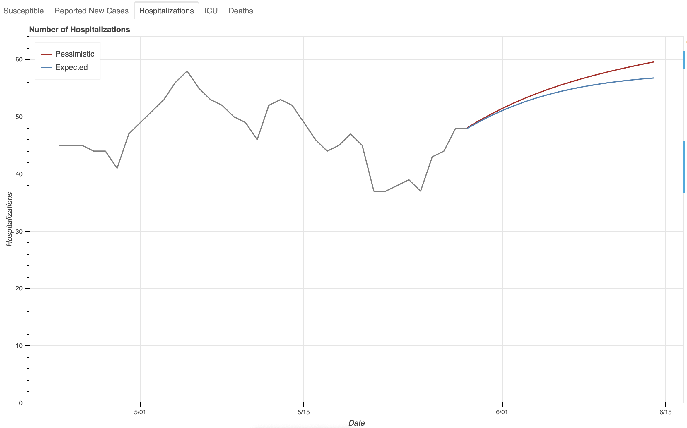
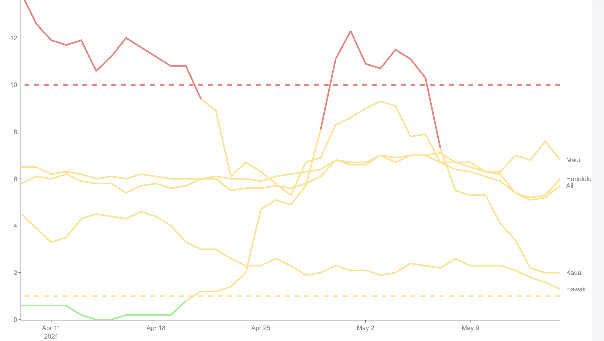
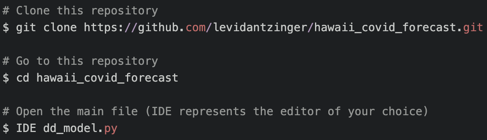

# Hawaii COVID Forecast
## About:
The Hawaii COVID Forecast is a python-based SEIR model designed to produce a projection of case counts, # of persons in hospital beds, # of persons in ICU beds, and deaths for the state of Hawaii. The SEIR model is modified to allow for inter-compartmental, inter-directional flow while also allowing for multiple modifications to the variables R(t) & # of Incoming Infected Travelers over a given period. The model selects parameters that best match the previous two-week trends of COVID-19 in the islands, but allows for independent manipulation for running different scenarios. The model produces visualizations the projection in both Bokeh & Plotly, in addition to containing a section that produces visualizations for Cases per 100k & Test Positivity Rate for the state of Hawai'i at a county level.

The data is scraped from the [Hawaii Department of Health](https://health.hawaii.gov/coronavirusdisease2019/what-you-should-know/current-situation-in-hawaii/) by the [Hawaii Data Collaborative](https://www.hawaiidata.org/) and can be found in this [google sheet](https://docs.google.com/spreadsheets/d/1sd-L317Je9ZhiQh3_uH9jTkl3ckc_o3sgrVauShcwCk/edit#gid=0).

### Projection of Hospitalizations (Bokeh Visualization)
<!--  -->


### Cases Per 100k by County (Plotly Visualization)
<!--  -->


## How-to:
While the script can be run in aggregate using the terminal, I often run it in blocks to control the pop-up visualizations. I would recommend opening in an IDE per the below and running in sections.

<!--  -->
<!--  -->
```javascript
# Clone this repository
$ git clone https://github.com/levidantzinger/hawaii_covid_forecast.git

# Go to this repository
$ cd hawaii_covid_forecast

# Open the main file (IDE represents the editor of your choice)
$ IDE dd_model.py
```
